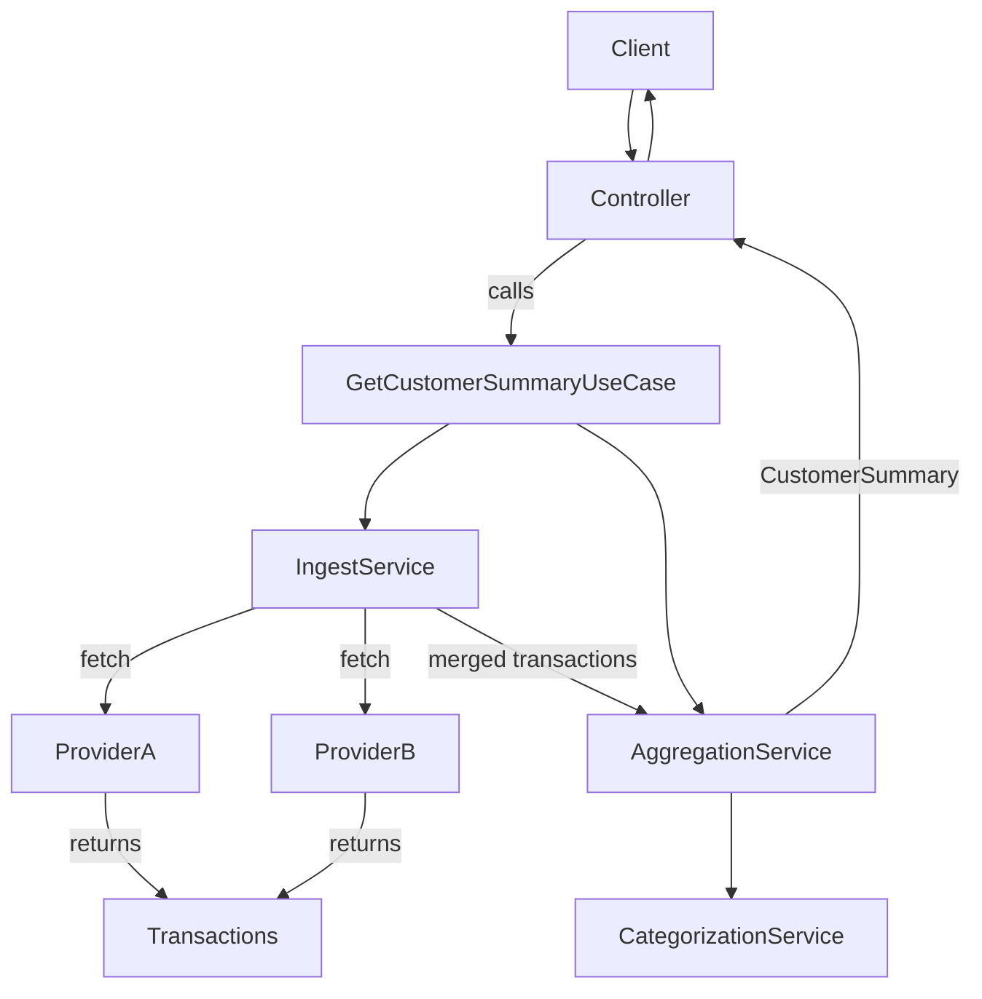

# Transaction Aggregation API

A Spring Boot application that ingests customer transactions from multiple mock providers, categorizes them using domain rules, persists normalized data, and exposes aggregated financial insights via REST APIs.

The system is built using Hexagonal Architecture (Ports & Adapters) to ensure separation of concerns, testability, and maintainability.

## Core Features

- **Ingest transactions** for a customer from multiple providers
- **Auto-categorize** transactions using simple rule-based matching (regex on merchant names)
- **Persist** transactions to a relational DB via JPA
- **Retrieve**:
    - all transactions for a customer
    - overall summary (total, per-category, average, highest, count)
    - monthly summaries (keyed by `YYYY-MM`)

## Final Architecture

## Tech Stack

- Java **25**
- Spring Boot (Web MVC, Data JPA, Actuator)
- PostgreSQL (runtime) + H2 (tests)
- Gradle (wrapper included)
- Docker / docker-compose (Postgres)

## Project Structure (high level)

- `domain/` — core model + aggregation & categorization logic, ports (interfaces)
- `application/` — use cases and services implementing them
- `infrastructure/`
    - `external/` — adapters/clients for fetching transactions
    - `persistence/` — JPA entities + repository adapter
- `web/` — REST controller
- `resources/` — Spring configuration (`application.yaml`, `application-test.yaml`)

## Requirements

- JDK **25**
- Docker (optional, for local Postgres)
- Gradle is provided via `./gradlew`

## Configuration

The API runs on:

- **Port:** `8081`
- **Base path:** `/api/v1`

Default datasource (local dev) points to Postgres:

- JDBC URL: `jdbc:postgresql://localhost:5432/postgres`
- User: `root`
- Password: `secret`

> Tip: for tests, the project uses an in-memory H2 database via the `test` profile.

## Run with Docker (PostgreSQL)

Start Postgres:
